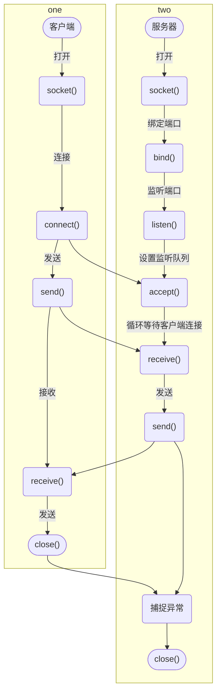

## Socket通信流程

```mermaid
graph TD
    connect --> server_accept
    client_send --> server_receive
    server_send --> client_receive
    client_close --> server_trigger

    subgraph two
    server([服务器])
    server_socket("socket()")
    server_bind("bind()")
    server_listen("listen()")
    server_accept("accept()")
    server_receive("receive()")
    server_send("send()")
    server_trigger("捕捉异常")
    server_close(["close()"])

    server -->|打开| server_socket
    server_socket -->|绑定端口| server_bind
    server_bind -->|监听端口|server_listen
    server_listen -->|设置监听队列|server_accept
    server_accept -->|循环等待客户端连接|server_receive
    server_receive -->|发送|server_send
    server_send --> | | server_trigger
    server_trigger -->| | server_close
    end

    subgraph one
    client([客户端])
    client_socket("socket()")
    connect("connect()")
    client_send("send()")
    client_receive("receive()")
    client_close(["close()"])

    client -->|打开|client_socket
    client_socket --->|连接|connect
    connect -->|发送|client_send
    client_send -->|接收|client_receive
    client_receive -->|发送|client_close
    end
```

